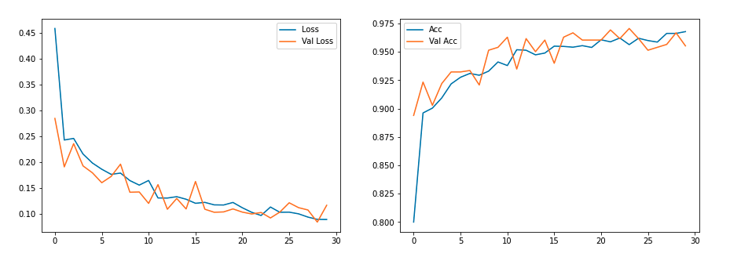

# Pneumonia X-Ray Image Classification


# Overview

<br>
Pneumonia is an infection that inflames the air sacs in our lungs. Many germs can cause pneumonia -- the most common are bacteria and viruses in the air we breathe. Your body usually prevents these germs from infecting your lungs, but sometimes these germs can overpower your immune system, even if your health is generally good. Pneumonia is the world’s leading cause of death among children under 5 years of age.
An x-ray exam will allow a medical professional to see your lungs, heart and blood vessels to help determine if you have pneumonia. When interpreting the x-ray, the radiologist will look for white spots in the lungs (called infiltrates) that identify an infection.

Using Convolutional Neural Networks we can train a model that identifies whether a patient has pneumonia given a chest x-ray. Our final model has a 95% accuracy on our testing images.

# Business Understanding 
Machine Learning has shown impressive accuracy in medical imaging. My team was hired by a leading hospital in Seattle to create a predictive model for identifying pneumonia from x-ray images. This technology provides medical professionals with a system that can automate the process for accurate identification of pneumonia, saving time and resources. 

As with many predictive models used in medicine, we want to prioritize minimizing false negatives (patient has pnumonia but the model classifies their x-ray as normal) over false positives (patient doesn't have pnumonia but the model classifies x-ray as pnumonia). This is because we are dealing with the lives and health of humans. Therefore we want to create a model that minimizes false negatives.

# Data Understanding
This dataset contains 5,856 validated Chest X-Ray images. The images categorized into two subsets -- Pneumonia and Normal. The images are split into training, validation, and testing sets. Our data contains 3,692 images of chest x-rays with pneumonia and 1,382 images of chest x-rays without pneumonia

This dataset comes from Kermany et al and can be found at https://data.mendeley.com/datasets/rscbjbr9sj/3

All x-rays were initially screened for quality control and graded by three expert physicians before being cleared for training the AI system.

# Modeling
1. The modeling began with a baseline Neural Network model which gave us an average of 82% accuracy. 
2. In attemps to increase our accuracy score, we used an untuned Convolutional Neural Network model, which resulted in strong overfitting
3. Using various dropout and regression techniques we increased our model accuracy and decreased loss, but were still running into overfitting issues
4. Finally we used augmentation, using ImageDataGenerator and tuning shear_range, zoom_range, and horizontal_flip. This model resulted in the hgihest accuracy, lowest loss, and no overfitting. 

# Final Evaluation
Final model evaluation resulted in 95% accuracy and a loss score of 0.1 <br>



(I was unable to set a random seed to keep modeling consistent when the notebook was restarted so I saved one of the final models using tensorflow's save and load_model functions. The accuracy rates for our final model ranged from 93% to 96% accuracy and usually remaining at 0.1 for loss score.)

# Conlusion
Our final model has an accuracy of 95% on predicting whether an x-ray image contains evidence of Pneumonia (viral or bacterial). As we can see from our confusion matrix, our model shows to classify more false positives ('classifies as pnumonia, but not') than false negatives ('classifies as normal, but actually pneumonia'). This alligns strongly with our business problem so we will consider this model to be very efficient in classifying pneumonia from chest x-rays.

# Next Steps
This type of methodology can be extremely useful in the identification of infections and adnormalities in medical imaging (not just x-ray but MRI, CT's, etc..). The use of maching learning techniques has the potential to be extremely useful in the medical field, but it also has the potential to be harmful. We have to be mindful with the types of scenarios we are using maching learning and AI for and be socially responsible when diploying models. 

# Further Questions
See the full analysis in the [Jupyter Notebook](https://github.com/hannah-schurman/pneumonia-image-classification/blob/main/pneumonia-image-classification.ipynb) or review [this presentation]()

For any additional questions, please contact Hannah Schurman at [hannah.schurman1@gmail.com](hannah.schurman1@gmail.com)

# Repository Structure
```
├── data                # contains original datasets and saved models
│   ├── chest_xray      # X-Ray images split into train, test, validation
│   ├── models          # Saved tensorflow model
├── images 
├── README.md
├── pneumonia-image-classification.ipynb
└── pneumonia_image_classification.pdf

```